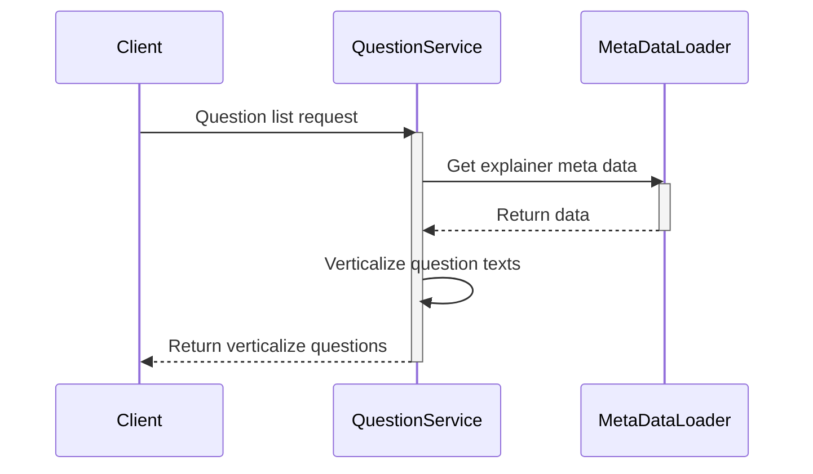

# ADV XAI FULFILMENT

<small>version 0.0.1 of 19/11/2024</small>

## Summary

-   [Glossary](#glossary)
-   [Project Description](#10-description)
-   [Software Architecture](#20-software-architecture)
    -   [Domain-Driven-Design (DDD)](#21-domain-driven-design-ddd)
    -   [Bucket Repository (SECURESTORE)](#22-bucket-repository)
    -   [Services Description](#23-services-description)
-   [Environment](#30-environment)
    -   [Test](#31-test)
    -   [Setup](#32-setup)
    -   [Start-up](#33-startup)

## Glossary

| term    | description                                                              |
| ------- | ------------------------------------------------------------------------ |
| service | by service we mean the "xai-fulfilment" project accessible via REST API; |

## [1.0] Description

This project focuses on the development of a fulfilment system based on Explainable AI (_XAI_) techniques. The goal is to provide an interface for data management and analysis, with particular attention to the transparency and interpretability of the artificial intelligence models used.

## [2.0] Software Architecture

This project is a microservice that exposes a REST server for fulfilment management. The microservice code is written following the principles of Domain-Driven Design (DDD), ensuring a modular and easily maintainable structure.

### [2.1] Domain-Driven-Design (DDD)

For the development of this project, _Domain-Driven Design (DDD)_ was adopted, an approach to software development that emphasizes collaboration between domain experts and developers to create a software model that accurately reflects the business domain reality. The main goal of _DDD_ is to manage the complexity of software systems by dividing the domain into bounded contexts and using a ubiquitous language that is understandable to both developers and domain experts.

Key concepts of _DDD_ include:

-   **Entities**: Objects that have a distinct identity and lifecycle.
-   **Value Objects**: Objects that are defined by their attributes rather than an identity.
-   **Aggregates**: Groups of entities and value objects that are treated as a single unit.
-   **Repository**: Mechanisms for accessing aggregates.
-   **Domain Services**: Operations that do not belong to any specific entity or value object.
-   **Domain Events**: Events that represent something significant that has happened in the domain.

### [2.2] Bucket Repository

The _SECURESTORE_ server is a secure and scalable repository designed to store and manage data objects. It ensures data integrity and confidentiality through encryption and access control mechanisms. The server supports various storage backends and provides a RESTful API for seamless integration with other services.

We have a proper bucket and here there is the folder organization:


### [2.3] Services Description

#### [2.3.1] QuestionService

-   **generate_from_dict** method:



## [3.0] Environment

### [3.1] Test

To run tests digit:

```bash
python -m unittest -v
```

To have a _coverage_ report digit:

```bash
python -m coverage run -m unittest | python -m coverage report
```

### [3.2] Setup

Programming language required:

```bash
python 3.9.0
```

Installation script:

```bash
pyenv local 3.9.0
pyenv exec python -m venv venv
.\venv\Scripts\activate
pip install -r requirements.txt
```

### [3.3] Start-up

#### DEBUG mode

```bash
.\venv\Scripts\activate
python .\startServer.py -LEVEL DEBUG
```

the debug server will be accessible with swagger at the endpoint `http://localhost:8505/api/doc`

push on agridatavalue gitlab
create the tag

---

Contact: <m.colageo@almaviva.it>
