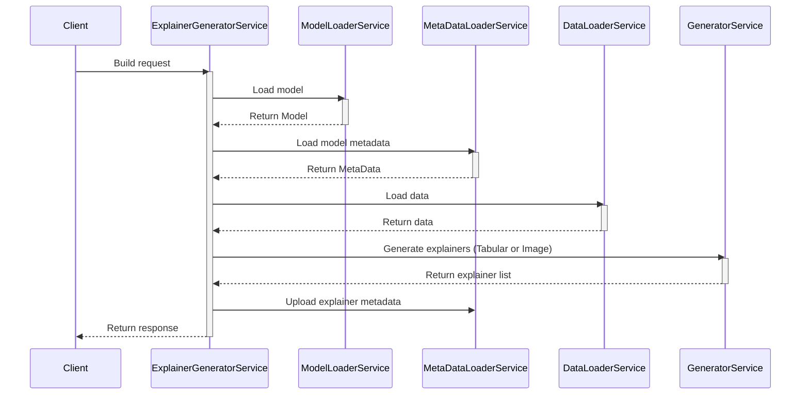
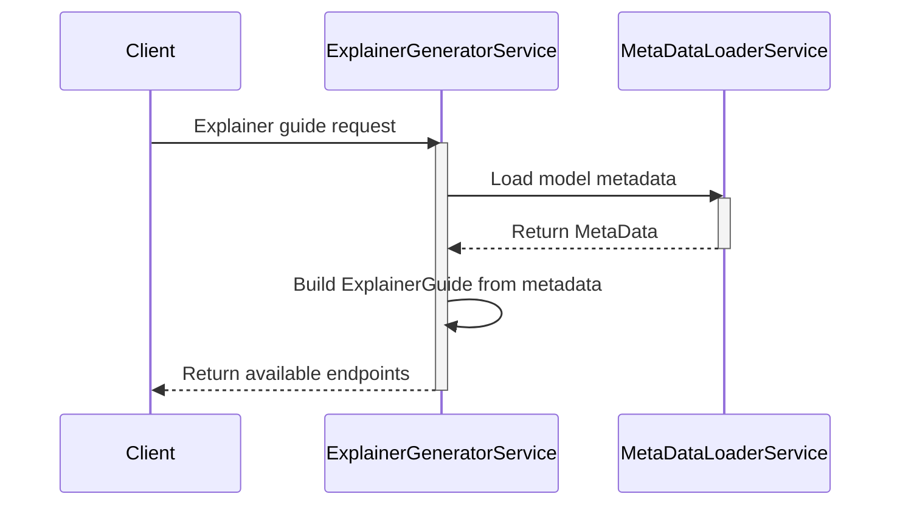
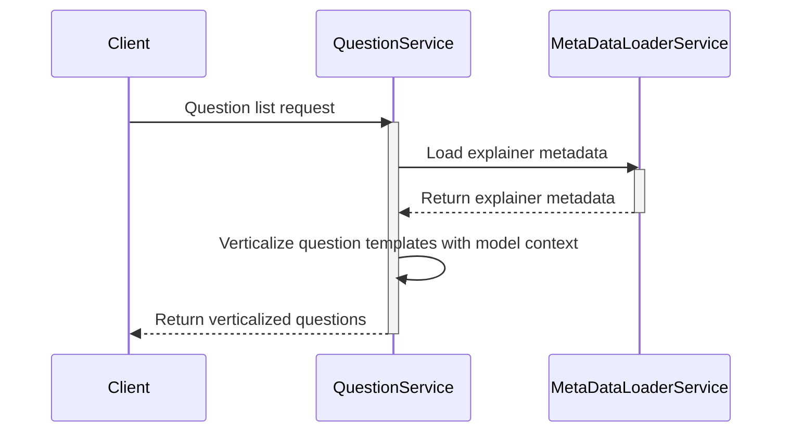
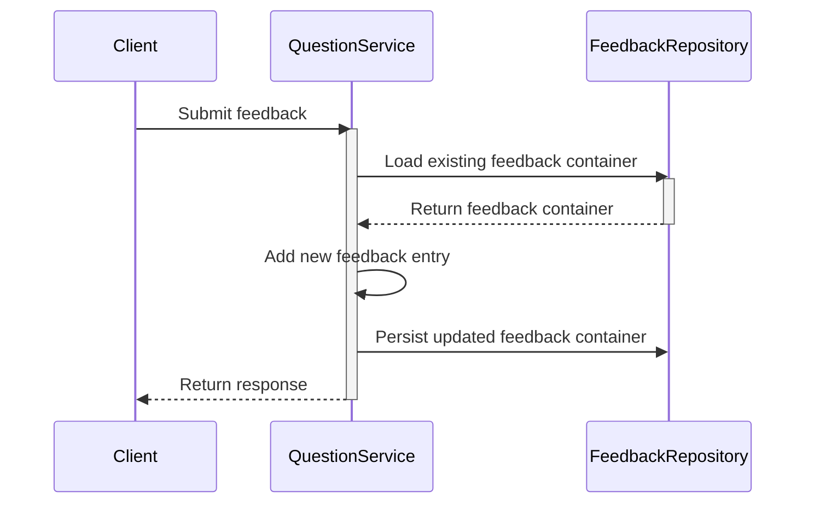
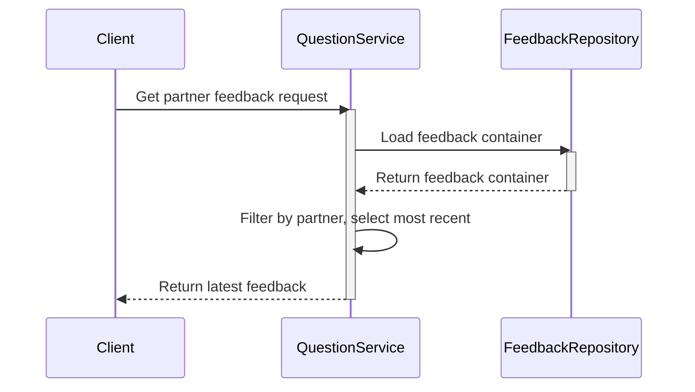
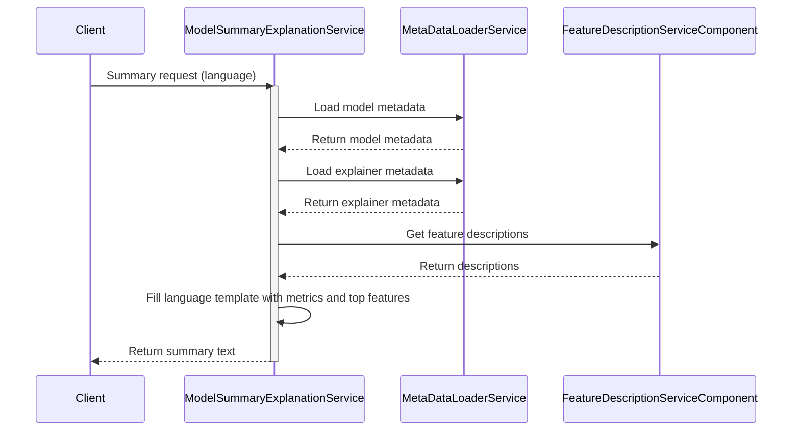
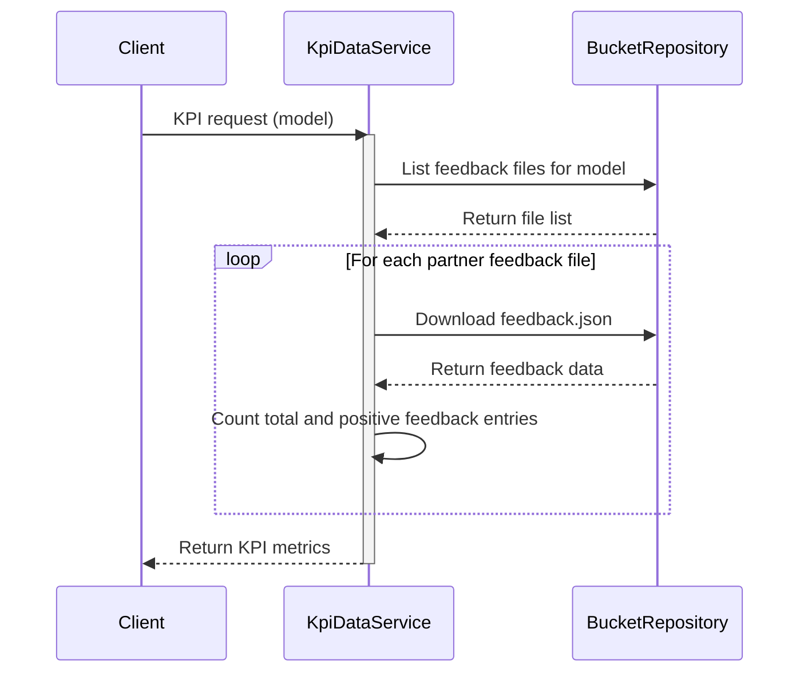

# ADV XAI FULFILMENT

**Version 0.0.3** - _Updated: April 23, 2026_

## Table of Contents

- [ADV XAI FULFILMENT](#adv-xai-fulfilment)
    - [Table of Contents](#table-of-contents)
    - [Glossary](#glossary)
        - [General](#general)
        - [XAI Techniques](#xai-techniques)
    - [Project Description](#project-description)
    - [Software Architecture](#software-architecture)
        - [Domain-Driven-Design (DDD)](#domain-driven-design-ddd)
        - [Bucket Repository (SECURESTORE)](#bucket-repository-securestore)
        - [Services Description](#services-description)
            - [ExplainerGeneratorService](#explainergeneratorservice)
            - [QuestionService](#questionservice)
            - [ModelSummaryExplanationService](#modelsummaryexplanationservice)
            - [KpiDataService](#kpidataservice)
    - [Environment](#environment)
        - [Testing](#testing)
        - [Setup](#setup)
        - [Start-up](#start-up)
            - [Development Mode](#development-mode)
    - [API Documentation](#api-documentation)
        - [Explainer](#explainer)
        - [Model Card](#model-card)
        - [Data Card](#data-card)
        - [Feedback](#feedback)
        - [KPI](#kpi)
        - [Utilities](#utilities)
    - [Environment Variables](#environment-variables)
        - [Server](#server)
        - [SECURESTORE (Minio)](#securestore-minio)
        - [Storage Buckets](#storage-buckets)
        - [Filesystem](#filesystem)
    - [Deployment](#deployment)
        - [Kubernetes](#kubernetes)
        - [Helm Charts](#helm-charts)
        - [Docker](#docker)
    - [Contact](#contact)
    - [License](#license)

## Glossary

### General

| Term           | Description                                                                                                                  |
| -------------- | ---------------------------------------------------------------------------------------------------------------------------- |
| Service        | The "xai-fulfilment" project accessible via REST API                                                                         |
| XAI            | Explainable Artificial Intelligence                                                                                          |
| DDD            | Domain-Driven Design                                                                                                         |
| Metadata       | Structured information describing models, features, and data sources                                                         |
| Feature        | Input variable used by machine learning models                                                                               |
| Target         | Output variable or prediction made by the model                                                                              |
| Partner        | Organization or entity contributing models to the platform                                                                   |
| Pilot          | Specific project or use case within the agricultural domain                                                                  |
| Model Category | Classification of a model's task type: Classification, Regression, Object Detection, or Time Series Anomaly Detection (TSAD) |
| Framework      | Machine learning library used to train a model (e.g. PyTorch, Keras, Scikit-Learn, XGBoost)                                  |
| Algorithm      | Specific learning algorithm within a framework (e.g. RandomForest, KNN, XGBoost)                                             |
| SECURESTORE    | Secure object storage repository (Minio-based) for models, explainers, metadata, and feedback                                |
| Feedback       | Partner assessment of explainer quality, collected via structured questions and answers                                      |
| KPI            | Key Performance Indicator; aggregated metrics on explainer usage and feedback quality                                        |
| Verticalize    | Process of contextualizing a question template with model- and target-specific information                                   |

### XAI Techniques

| Term                   | Description                                                                                                   |
| ---------------------- | ------------------------------------------------------------------------------------------------------------- |
| Explainer              | Component that applies a specific XAI technique to a model and returns interpretable output                   |
| Global Explanation     | Explanation describing overall model behaviour across the full dataset                                        |
| Local Explanation      | Explanation specific to a single prediction or data point                                                     |
| BlackBox Explainer     | Model-agnostic explainer that works without access to model internals                                         |
| WhiteBox Explainer     | Explainer that leverages model internals (weights, structure); model-specific                                 |
| SHAP                   | SHapley Additive exPlanations — framework assigning each feature an importance value for a prediction         |
| TabPFN                 | Pre-trained foundation model for tabular data; supports fast inference and SHAP-based explanations            |
| LIME                   | Local Interpretable Model-agnostic Explanations — explains individual predictions via a local surrogate model |
| ALE                    | Accumulated Local Effects — measures feature effects while avoiding extrapolation issues of PDPs              |
| PDP                    | Partial Dependence Plot — shows the marginal effect of one or two features on model predictions               |
| ICE                    | Individual Conditional Expectations — per-instance variant of PDP                                             |
| Anchors                | Rule-based explanation method that finds the minimal conditions sufficient to justify a prediction            |
| Integrated Gradients   | Deep learning attribution method computing feature importance via gradient integration                        |
| Permutation Importance | Feature importance measured by the prediction degradation after shuffling a feature's values                  |
| Counter-Factuals       | Explanation method finding minimal input changes that alter a model's prediction                              |
| Heatmap                | Pixel-level visual explanation for image-based models showing which regions influenced a prediction           |
| Confusion Matrix       | Classification evaluation table showing true/false positives and negatives                                    |
| Lift Curve             | Performance chart visualising cumulative gains for ranked predictions in classification tasks                 |
| Anomaly Score          | Output metric from anomaly detection models indicating the degree of abnormality of a data point              |

## Project Description

This project focuses on the development of a fulfilment system based on Explainable AI (XAI) techniques. The goal is to provide an interface for data management and analysis, with particular attention to the transparency and interpretability of artificial intelligence models used.

The system supports various machine learning models including:

- Neural Networks (PyTorch, Keras)
- Gradient Boosting (XGBoost, CatBoost, LightGBM)
- Random Forest Classifiers
- Logistic Regression models
- K-Nearest Neighbors (KNN)
- Computer Vision models (YOLO)
- Isolation Forest for anomaly detection

## Software Architecture

This project is a microservice that exposes a REST server for fulfilment management. The microservice code is written following the principles of Domain-Driven Design (DDD), ensuring a modular and easily maintainable structure.

### Domain-Driven-Design (DDD)

For the development of this project, Domain-Driven Design (DDD) was adopted, an approach to software development that emphasizes collaboration between domain experts and developers to create a software model that accurately reflects the business domain reality. The main goal of DDD is to manage the complexity of software systems by dividing the domain into bounded contexts and using a ubiquitous language that is understandable to both developers and domain experts.

Key concepts of DDD include:

- **Entities**: Objects that have a distinct identity and lifecycle
- **Value Objects**: Objects that are defined by their attributes rather than an identity
- **Aggregates**: Groups of entities and value objects that are treated as a single unit
- **Repository**: Mechanisms for accessing aggregates
- **Domain Services**: Operations that do not belong to any specific entity or value object
- **Domain Events**: Events that represent something significant that has happened in the domain


### Bucket Repository (SECURESTORE)

The SECURESTORE server is a secure and scalable repository designed to store and manage data objects. It ensures data integrity and confidentiality through encryption and access control mechanisms. The server supports various storage backends and provides a RESTful API for seamless integration with other services.

We have a proper bucket and here there is the folder organization:


### Services Description

The application layer is composed of the following services:

| Service                          | Responsibility                                                                                                                   |
| -------------------------------- | -------------------------------------------------------------------------------------------------------------------------------- |
| `ExplainerGeneratorService`      | Orchestrates the build pipeline: loads model, data and metadata, runs the appropriate generator, stores the resulting explainers |
| `QuestionService`                | Manages the feedback question lifecycle: retrieves verticalized questions and persists/retrieves partner feedback                |
| `ModelSummaryExplanationService` | Generates a natural-language summary of a model's behaviour and performance in the requested language                            |
| `KpiDataService`                 | Aggregates feedback data across all partners to compute model-level KPI metrics                                                  |
| `TabularGeneratorService`        | Internal generator for tabular data: computes performance metrics, selects compatible explainers, and runs each one              |
| `ImageGeneratorService`          | Internal generator for image data: produces heatmap visualisations via `HeatmapComponentService`                                 |

---

#### ExplainerGeneratorService

- **`generate_explainer`** — full build pipeline triggered by `POST /build`:



- **`describe_explainer`** — returns the available explainer endpoints for a model (`GET /get-explainer-guide`):



---

#### QuestionService

- **`generate_from_dict`** — returns verticalized feedback questions (`GET /feedback`):



- **`save_partner_feedback`** — persists partner feedback (`POST /feedback`):



- **`get_partner_feedback`** — retrieves the latest feedback for a partner (`GET /{partner}/feedback`):



---

#### ModelSummaryExplanationService

- **`get_model_summary`** — generates a natural-language model summary (`POST /get-summary/{language}`):



---

#### KpiDataService

- **`get_model_feedback`** — aggregates feedback KPIs across all partners (`GET /kpi/feedback/{model}`):



## Environment

### Testing

To run tests:

```bash
python -m unittest -v
```

To generate a coverage report:

```bash
python -m coverage run -m unittest | python -m coverage report
```

Current coverage report:

```bash
Name                                                                                       Stmts   Miss  Cover
--------------------------------------------------------------------------------------------------------------
src/__init__.py                                                                                0      0   100%
src/adv_xai_fulfilment/application/ExplainerGeneratorService.py                               65     41    37%
src/adv_xai_fulfilment/application/ModelPerformanceMetricService.py                           31      2    94%
src/adv_xai_fulfilment/domain/model/DataType.py                                               13      5    62%
src/adv_xai_fulfilment/domain/model/ExplainerIdentifier.py                                    25      5    80%
src/adv_xai_fulfilment/domain/model/ExplainerMetaData.py                                      44     10    77%
src/adv_xai_fulfilment/domain/model/FeatureDescription.py                                     12      1    92%
src/adv_xai_fulfilment/domain/model/Model.py                                                  19      1    95%
src/adv_xai_fulfilment/domain/model/ModelMetaData.py                                          35      4    89%
src/adv_xai_fulfilment/domain/model/Partner.py                                                 9      2    78%
src/adv_xai_fulfilment/domain/model/explainers/AleExplainer.py                                13      0   100%
src/adv_xai_fulfilment/domain/model/explainers/AnchorsExplainer.py                            11      0   100%
src/adv_xai_fulfilment/domain/model/explainers/CounterFactualsPrototypesExplainer.py          11      0   100%
src/adv_xai_fulfilment/domain/model/explainers/CounterFactualsWithRlExplainer.py              11      0   100%
src/adv_xai_fulfilment/domain/model/explainers/DataTypeModelExplainer.py                       7      0   100%
src/adv_xai_fulfilment/domain/model/explainers/DeepExplainerExplainer.py                       9      1    89%
src/adv_xai_fulfilment/domain/model/explainers/Explainer.py                                   53      8    85%
src/adv_xai_fulfilment/domain/model/explainers/IntegratedGradientsExplainer.py                11      0   100%
src/adv_xai_fulfilment/domain/model/explainers/KernelExplainerExplainer.py                    14      1    93%
src/adv_xai_fulfilment/domain/model/explainers/KernelSHAPExplainer.py                         10      0   100%
src/adv_xai_fulfilment/domain/model/explainers/PartialDependenceExplainer.py                  11      0   100%
src/adv_xai_fulfilment/domain/model/explainers/PartialDependenceVarianceExplainer.py          11      0   100%
src/adv_xai_fulfilment/domain/model/explainers/PermutationImportanceExplainer.py              11      0   100%
src/adv_xai_fulfilment/domain/model/explainers/RegressionExplainer.py                         11      2    82%
src/adv_xai_fulfilment/domain/model/explainers/SimilarityExplanationsExplainer.py             11      0   100%
src/adv_xai_fulfilment/domain/model/explainers/TreeShapInterventionalExplainer.py             11      0   100%
src/adv_xai_fulfilment/domain/model/explainers/TreeShapPathDependentExplainer.py              11      0   100%
src/adv_xai_fulfilment/domain/model/explainers/__init__.py                                    16      0   100%
src/adv_xai_fulfilment/domain/model/machineLearningModel/KerasModel.py                        15      2    87%
src/adv_xai_fulfilment/domain/model/machineLearningModel/ScikitLearnModel.py                   9      2    78%
src/adv_xai_fulfilment/domain/model/machineLearningModel/TorchModel.py                         5      0   100%
src/adv_xai_fulfilment/domain/model/questions/Answer.py                                       16      1    94%
src/adv_xai_fulfilment/domain/model/questions/Feedback.py                                     30      9    70%
src/adv_xai_fulfilment/domain/model/questions/Question.py                                     42      2    95%
src/adv_xai_fulfilment/domain/service/ExplainerRetriever.py                                   21      1    95%
src/adv_xai_fulfilment/domain/service/FeatureDescriptionServiceComponent.py                   11      2    82%
src/adv_xai_fulfilment/domain/service/FeatureImportanceServiceComponent.py                    57     27    53%
src/adv_xai_fulfilment/domain/service/ModelPerformanceServiceComponent.py                     17      1    94%
src/adv_xai_fulfilment/domain/service/ModelTranslator.py                                      20      0   100%
src/adv_xai_fulfilment/infrastructure/Constants.py                                            24      0   100%
src/adv_xai_fulfilment/infrastructure/Helper.py                                               11      0   100%
src/adv_xai_fulfilment/infrastructure/repository/BucketRepository.py                          14      6    57%
src/adv_xai_fulfilment/infrastructure/service/DataLoaderService.py                            67     22    67%
src/adv_xai_fulfilment/infrastructure/service/ExplainerRepositoryService.py                   39     21    46%
src/adv_xai_fulfilment/infrastructure/service/ModelLoaderService.py                           39      7    82%
src/adv_xai_fulfilment/infrastructure/service/translator/ExplainerMetaDataTranslator.py       18      0   100%
src/adv_xai_fulfilment/infrastructure/service/translator/ExplainerTranslator.py                4      0   100%
src/adv_xai_fulfilment/infrastructure/service/translator/FeatureDescriptionTranslator.py       4      0   100%
src/adv_xai_fulfilment/infrastructure/service/translator/FeedbackTranslator.py                13      3    77%
src/adv_xai_fulfilment/infrastructure/service/translator/ModelMetaDataTranslator.py            8      0   100%
src/adv_xai_fulfilment/presentation/translator/DataPresentationsOutputTranslator.py            6      0   100%
src/adv_xai_fulfilment/presentation/translator/ExplainerIdentifierTranslator.py                5      0   100%
src/adv_xai_fulfilment/presentation/translator/FeedbackRequestTranslator.py                   15      0   100%
tests/__init__.py                                                                             21      0   100%
--------------------------------------------------------------------------------------------------------------
TOTAL                                                                                       1449    215    85%
```

### Setup

**Required Python version:**

```bash
python 3.9.0
```

**Installation:**

```bash
pyenv local 3.9.0
pyenv exec python -m venv venv
.\venv\Scripts\activate
pip install -r requirements.txt
```

### Start-up

#### Development Mode

**Option 1:**

```bash
.\venv\Scripts\activate
python .\startServer.py -LEVEL DEBUG
```

**Option 2:**

```bash
pyenv activate xai
python .\startServer.py -LEVEL DEBUG
```

The debug server will be accessible with Swagger documentation at: `http://localhost:8505/api/doc`

## API Documentation

The Swagger UI is available at `http://localhost:8505/api/doc` when the server is running in development mode.

The OpenAPI 3.0.3 specification is located at [`sources/api.yaml`](sources/api.yaml).

---

### Explainer

| Method | Endpoint                  | Description                                                                                                 |
| ------ | ------------------------- | ----------------------------------------------------------------------------------------------------------- |
| `POST` | `/build`                  | Build and store the explainers for a given model and partner                                                |
| `GET`  | `/get-explainer-guide`    | Return the list of available explainer endpoints for a model                                                |
| `POST` | `/get-summary/{language}` | Return a natural-language summary of the model explanation (`language`: `gb`, `it`, `de`, `es`, `fr`, `gr`) |
| `POST` | `/{model}/{partner}/ask`  | Ask a free-form question to the explainer                                                                   |

**`POST /build` — key request fields:**

| Field                | Type     | Required | Description                                  |
| -------------------- | -------- | -------- | -------------------------------------------- |
| `model`              | string   | yes      | Path to the ML model file (e.g. `model.pkl`) |
| `meta_data`          | string   | yes      | Path to the metadata file                    |
| `partner`            | string   | yes      | Partner identifier                           |
| `data_for_predict`   | string   | yes      | Folder identifier for prediction data        |
| `data_for_train`     | string   | yes      | Folder identifier for training data          |
| `prediction_targets` | string[] | no       | Target field names to explain                |

---

### Model Card

| Method | Endpoint                               | Description                                         |
| ------ | -------------------------------------- | --------------------------------------------------- |
| `POST` | `/feature-importance`                  | SHAP-based feature importance values                |
| `POST` | `/feature-descriptions`                | Human-readable description for each feature         |
| `POST` | `/feature-impact`                      | Feature impact for anomaly detection models         |
| `POST` | `/partial-dependence`                  | Partial Dependence Plot data for a given feature    |
| `POST` | `/individual-conditional-expectations` | ICE curves and PDP mean for a given feature         |
| `POST` | `/confusion-matrix`                    | Confusion matrix for classification models          |
| `POST` | `/lift-curve`                          | Lift curve and cumulative gains data                |
| `POST` | `/classification-class-label-sizes`    | Class label distribution above/below cutoff         |
| `POST` | `/model-performance`                   | Actual vs predicted values for regression models    |
| `POST` | `/model-performance-metrics`           | Aggregated performance metrics (accuracy, F1, etc.) |
| `POST` | `/data-features-and-average-score`     | Average anomaly score per feature                   |
| `POST` | `/anomaly-score`                       | Per-sample anomaly scores                           |
| `POST` | `/anomaly-vs-normal`                   | Count of anomalous vs normal samples                |
| `POST` | `/heatmap`                             | Heatmap image paths for image-based models          |

---

### Data Card

| Method | Endpoint             | Description                                 |
| ------ | -------------------- | ------------------------------------------- |
| `POST` | `/targets`           | Actual and predicted target values          |
| `POST` | `/data-distribution` | Histogram data for the dataset distribution |
| `GET`  | `/data-source-types` | List of data source types and counts        |

---

### Feedback

| Method | Endpoint              | Description                                                |
| ------ | --------------------- | ---------------------------------------------------------- |
| `GET`  | `/feedback`           | Retrieve the feedback question list for a model and target |
| `POST` | `/feedback`           | Submit partner feedback responses                          |
| `GET`  | `/{partner}/feedback` | Retrieve all feedback submitted by a partner               |

---

### KPI

| Method | Endpoint                | Description                                                            |
| ------ | ----------------------- | ---------------------------------------------------------------------- |
| `GET`  | `/kpi/feedback/{model}` | Feedback KPI metrics: total count, positive count, positive percentage |

---

### Utilities

| Method | Endpoint                   | Description                                    |
| ------ | -------------------------- | ---------------------------------------------- |
| `GET`  | `/{model}/{partner}/image` | Retrieve a stored image file (heatmaps, plots) |

---

**Common request fields** (shared by most endpoints):

| Field               | Type   | Description                                   |
| ------------------- | ------ | --------------------------------------------- |
| `model`             | string | Model file identifier (e.g. `model.pkl`)      |
| `partner`           | string | Partner identifier                            |
| `prediction_target` | string | Target field name (optional where applicable) |

**Common HTTP status codes:**

| Code  | Meaning                                |
| ----- | -------------------------------------- |
| `200` | Success                                |
| `400` | Invalid or missing request parameters  |
| `404` | Model, partner, or explainer not found |
| `500` | Internal server error                  |

## Environment Variables

All variables must be set before starting the server. There is no `.env` file by default — export them in the shell or configure them in the deployment manifest.

### Server

| Variable         | Default              | Description                                               |
| ---------------- | -------------------- | --------------------------------------------------------- |
| `SERVER_IP`      | `0.0.0.0`            | IP address the server binds to                            |
| `SERVER_PORT`    | `8000`               | Port the server listens on                                |
| `SERVER_URI`     | _(none)_             | Optional URI prefix (e.g. `/xai`) prepended to all routes |
| `SERVER_THREADS` | _(waitress default)_ | Number of worker threads for the WSGI server              |

### SECURESTORE (Minio)

| Variable           | Default      | Description                                     |
| ------------------ | ------------ | ----------------------------------------------- |
| `STORE_ENDPOINT`   | _(required)_ | Minio endpoint (e.g. `minio.example.com:9000`)  |
| `STORE_ACCESS_KEY` | _(required)_ | Minio access key                                |
| `STORE_SECRET_KEY` | _(required)_ | Minio secret key                                |
| `MINIO_SECURE`     | `true`       | Use HTTPS for Minio connection (`true`/`false`) |

### Storage Buckets

| Variable                | Default      | Description                                          |
| ----------------------- | ------------ | ---------------------------------------------------- |
| `MODEL_FOLDER_PATH`     | _(required)_ | Bucket name containing model and metadata files      |
| `DATA_FOLDER_PATH`      | _(required)_ | Bucket name containing training and prediction data  |
| `EXPLAINER_FOLDER_PATH` | _(required)_ | Bucket name where explainers and feedback are stored |

### Filesystem

| Variable | Default | Description                                         |
| -------- | ------- | --------------------------------------------------- |
| `TEMP`   | `/tmp`  | Local temp directory used to cache downloaded files |

## Deployment

### Kubernetes

The project includes Kubernetes deployment configurations:

- **Deployment**: `kubernetes/deployment.yml`
- **Service**: `kubernetes/service.yml`
- **Ingress**: `kubernetes/ingress.yml`
- **Secret**: `kubernetes/secret.yml`

### Helm Charts

Helm charts are available in `deployments/helm/xai-fulfillment/` for streamlined deployment.

### Docker

Build and run using Docker:

```bash
docker build -t xai-fulfillment .
docker run -p 8505:8505 xai-fulfillment
```

## Contact

**Maintainer**: m.colageo@almaviva.it

## License

This project is licensed under the **GNU Affero General Public License v3.0 (AGPL-3.0)**.

See the [`LICENSE`](LICENSE) file for the full license text.

Third-party software libraries used by this project and their respective licenses are listed in [`THIRD_PARTY_LICENSES.md`](THIRD_PARTY_LICENSES.md).
